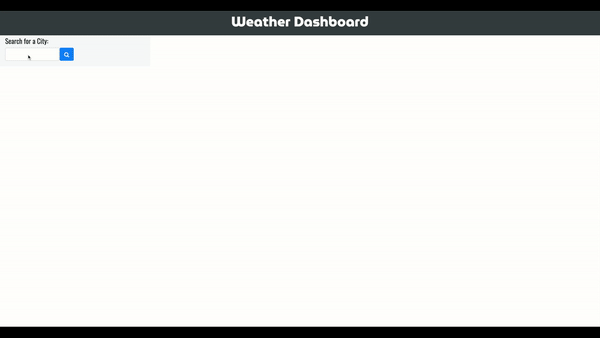
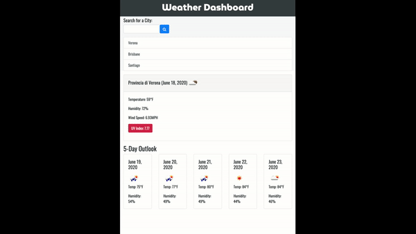
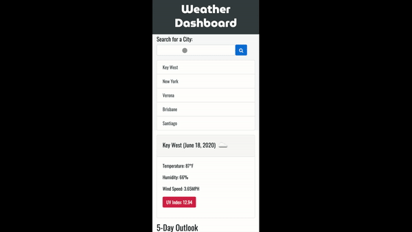

## Weather Dashboard

**Link to published app:** https://keycole.github.io/weather-dashboard/

## Purpose

A weather dashboard that will run in the browser and feature dynamically updated HTML and CSS displaying the weather outlook for requested cities.

## Built With
- OpenWeather Weather API: https://openweathermap.org/api
- Bootstrap: https://getbootstrap.com/
- Momentjs: https://momentjs.com/docs/
- Google Fonts: https://fonts.google.com/

## Screenshote

**Desktop**

**Tablet**

**Mobile**

